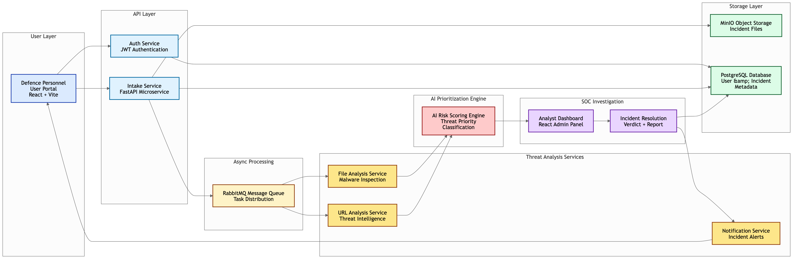

# 🛡️ Cyber Defence Portal (Threat Sentinel)

A **microservice-based cybersecurity platform** designed to help defence personnel securely report suspicious files, URLs, and cyber incidents for rapid analysis and prioritised response.

---

# 📌 Overview

Cyber Defence Portal is built to address a critical challenge in modern cybersecurity reporting systems.

Traditional cyber incident reporting portals often become overwhelmed by high volumes of public submissions. In such situations, **high-priority incidents affecting defence personnel may be delayed or overlooked**.

This platform solves the problem by creating a **dedicated, secure reporting and investigation system** designed specifically for defence environments.

The system enables:

- Secure reporting by verified defence personnel
- Intelligent prioritisation of threats
- Structured analysis workflows for analysts
- Administrative oversight for operational integrity

---

# 🚀 Key Features

## 🔐 Secure User Portal

Only **verified defence personnel** are allowed to register and log in.

Users can submit:

- Suspicious files
- Malicious attachments
- Suspicious URLs
- Cyber incident reports
- Supporting documents

All uploaded data is securely stored and processed.

---

## 📂 Secure File Handling

Uploaded files follow a secure processing pipeline.


Technologies used:

- **MinIO** → Object storage
- **RabbitMQ** → Message queue for asynchronous processing

---

## 🤖 AI Threat Prioritisation

An AI engine automatically analyses incoming submissions and prioritises threats.

Features include:

- Threat scoring
- Suspicious pattern detection
- Priority classification

High-risk files are automatically **flagged in red**, allowing analysts to focus on critical threats first.

---

## 🧑‍💻 Analyst Investigation Portal

Security analysts receive structured incident data including:

- File metadata
- AI threat score
- JSON-formatted analysis results
- Incident history

Analysts can:

- Investigate files and URLs
- Perform safe analysis
- Record investigation findings
- Submit a final verdict
- Close incidents

---

## 🛠 Admin Control Panel

The system includes an **administrative control layer**.

Admin capabilities:

- Login using predefined master credentials
- Create analyst accounts
- Manage analyst access
- Monitor incident investigations
- Maintain operational oversight

---

## 🧾 Incident Resolution Integrity

Every incident includes an audit trail.

When an analyst closes a case:

- Resolution notes are stored
- Analyst identity is recorded
- Incident status becomes **Closed**

Closed incidents remain visible to:

- Analysts
- Admin

This ensures **transparency and investigation accountability**.

---

# 🏗 System Architecture



---

# 🧩 Microservices

The platform consists of multiple independent services.

### Auth Service
Handles:

- Authentication
- User registration
- Role management
- Admin account creation

### Intake Service
Responsible for:

- File uploads
- URL submissions
- Incident creation
- Storage integration

### File Analysis Service
Performs:

- Malware analysis
- File metadata extraction
- Threat classification
- AI scoring

### URL Analysis Service
Responsible for:

- Suspicious URL investigation
- Domain analysis
- Threat intelligence checks

### Notification Service
Handles:

- Analyst alerts
- Incident updates
- System notifications

### Frontend Dashboard
React-based interface for:

- Analysts
- Admin users
- Incident monitoring

---

# 🧰 Technology Stack

## Frontend
- React.js
- Vite
- Axios
- Context API

## Backend
- Python
- FastAPI
- Microservice architecture

## Infrastructure
- Docker
- Docker Compose
- PostgreSQL
- RabbitMQ
- MinIO

## AI Components
Used for:

- Threat scoring
- Priority classification
- Incident triage

---

## 📁 Project Structure

```
ThreatSentinel
│
├── auth-service              # Authentication & user management
├── intake-service            # File and URL submission handling
├── file-analysis-service     # Malware and file inspection
├── url-analysis-service      # Suspicious URL investigation
├── notification-service      # Alerts and notifications
│
├── frontend-dashboard        # Analyst & Admin React dashboard
├── user-portal               # Defence personnel reporting portal
│
├── common                    # Shared models and utilities
│
├── docs                      # Architecture diagrams
│   └── architecture.png
│
├── docker-compose.yml        # Container orchestration
└── README.md
```
---

### 🚀 Start the Platform

From the project root directory run:

```bash
docker compose build
docker compose up
```

This command will:

- Build all microservice containers
- Start the application stack
- Initialize supporting infrastructure:
  - PostgreSQL
  - RabbitMQ
  - MinIO

---

### 🌐 Access the Platform

Once the containers are running, the services will be available at:

| Service | URL |
|--------|------|
| User Portal | http://localhost:3000 |
| Analyst Dashboard | http://localhost:3001 |
| MinIO Console | http://localhost:9001 |
| RabbitMQ Management | http://localhost:15672 |

---

### 🔑 Default Credentials

#### RabbitMQ

```
Username: guest
Password: guest
```

#### Admin Account

```
Username: ArmyChief
Password: SuperIndiaIsBest!
```

The **admin user** can create analyst accounts from the dashboard.

---

### 🔐 Security Considerations

The platform implements several security measures:

- Role-based access control (**RBAC**)
- Secure object storage using **MinIO**
- Asynchronous task processing with **RabbitMQ**
- Incident audit logging
- Controlled analyst access


